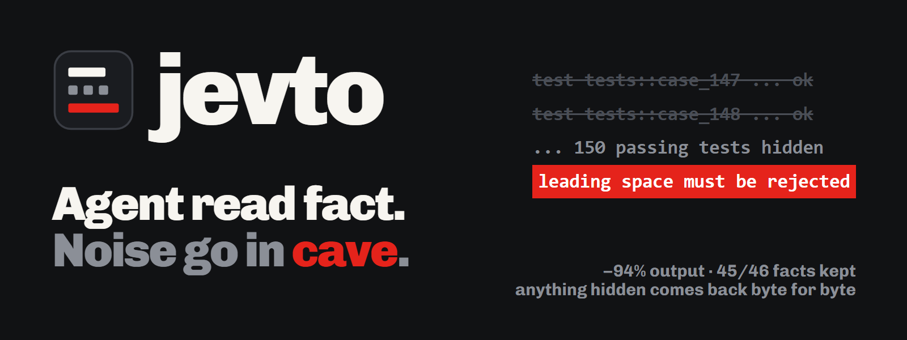
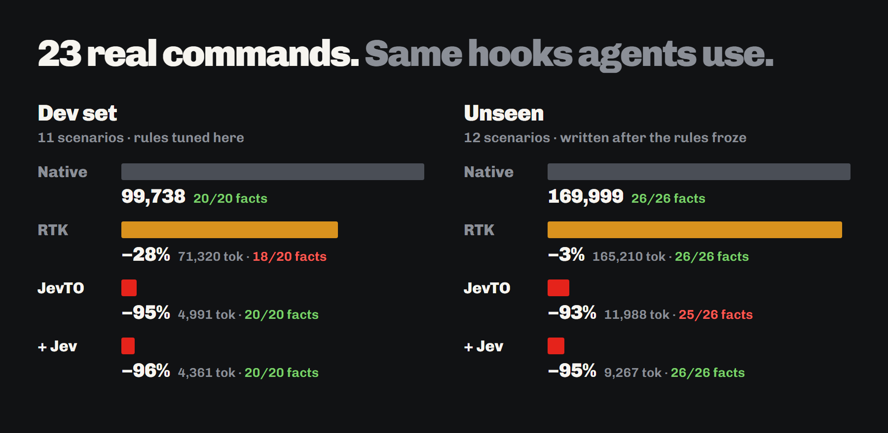
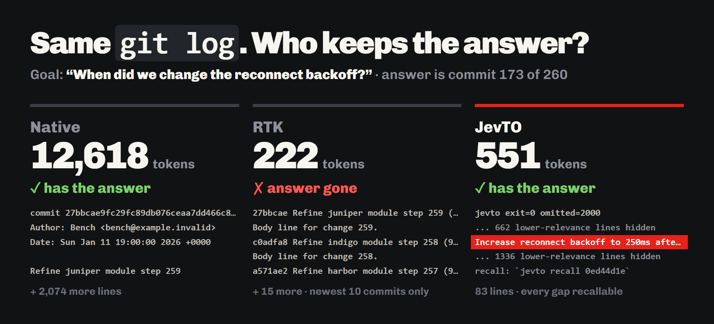
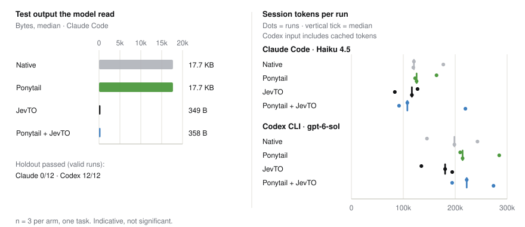
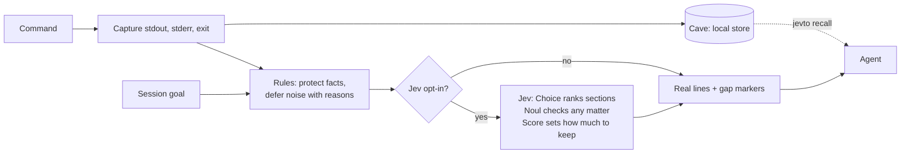
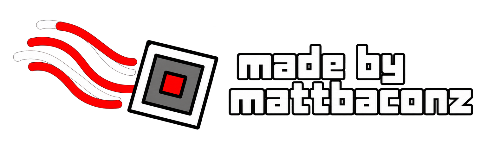

<p align="center"></p>

<h3 align="center">why agent read 173 line when 15 line say same thing?</h3>

<p align="center">
  
  
  
  
  
</p>

Agent run `cargo test`. Terminal throw 173 line at agent. 150 line say `ok`. Agent pay for all 173. Agent need maybe 5.

**JevTO stand between command and agent.** Keep fail. Keep assert. Keep line goal ask about. Rest go in **cave**. Cave not trash: cave keep every byte, and `jevto recall` bring any of it back exact. No rerun. No paraphrase. No guess.

<p align="center"></p>

> **Status:** experimental (v0.1.1). Apache-2.0. Not made by TypeSafe AI or RTK.

## 🪨 Before, after

**Before.** Native `cargo test`: 173 lines, ~1,245 tokens.

```text
running 151 tests
test tests::case_000 ... ok
test tests::case_001 ... ok
test tests::case_002 ... ok
   ... 147 more ok lines ...
test tests::case_149 ... ok
test tests::parse_header_rejects_leading_space ... FAILED

failures:

---- tests::parse_header_rejects_leading_space stdout ----
thread '...' panicked at src\lib.rs:310:9:
assertion `left == right` failed: leading space must be rejected
  left: Some((" k", "v"))
 right: None
note: run with `RUST_BACKTRACE=1` ...

failures:
    tests::parse_header_rejects_leading_space

test result: FAILED. 150 passed; 1 failed; ...
```

**After.** Through JevTO: 15 lines, ~162 tokens.

```text
jevto exit=101 omitted=161
... 150 passing tests hidden [stdout-19-4219]
test tests::parse_header_rejects_leading_space ... FAILED

failures:

---- tests::parse_header_rejects_leading_space stdout ----

thread '...' panicked at src\lib.rs:310:9:
assertion `left == right` failed: leading space must be rejected
  left: Some((" k", "v"))
 right: None
test result: FAILED. 150 passed; 1 failed; ...
error: test failed, to rerun pass `--lib`
recall: `jevto recall a75f7b57` [--section ID]
```

Same exit code. Same failure. Same assertion. Real lines, not summary (thread name and a few long lines shortened here to fit). Gap marker say what hidden and where it live.

## 📊 Numbers

23 scenarios. Each one build fresh workspace, run real command. Each tool go through **its own Claude Code hook**, so each tool route exactly what it route for real agent. **Fact** = string task need (failing test, assertion, right commit, fixed line), counted only when visible without recall.

<p align="center"></p>

| Suite | Native | [RTK](https://github.com/rtk-ai/rtk) 0.48 | JevTO (rules) | JevTO + Jev |
| --- | ---: | ---: | ---: | ---: |
| **Dev** · 11 scenarios, rules tuned here | 99,738 · 20/20 facts | 71,320 (−28%) · 18/20 | 4,991 (−95%) · 20/20 | **4,361 (−96%) · 20/20** |
| **Holdout** · 9 scenarios, written after rules froze | 123,100 · 23/23 | 118,498 (−4%) · 23/23 | **7,371 (−94%) · 23/23** | **7,371 (−94%) · 23/23** |
| **Semantic** · 3 scenarios, goal and answer share no word | 46,899 · 3/3 | 46,712 (−0%) · 3/3 | 4,617 (−90%) · 2/3 | **1,896 (−96%) · 3/3** |
| **All 23** | 269,737 · 46/46 | 236,530 (−12%) · 44/46 | 16,979 (−94%) · 45/46 | **13,628 (−95%) · 46/46** |

Tokens = bytes ÷ 4, one command's output. Miss a fact? Agent must go read everything, so the benchmark charges the full native payload for every miss. With that charge: native 269,737 → RTK 256,373 → JevTO 18,111 → JevTO + Jev 13,628.

### Small number not enough. Answer must survive.

<p align="center"></p>

Truncate is cheap. Truncate also throw away commit 173. JevTO keep it and still cut 96%.

### Where JevTO win, where JevTO lose

- **Win big.** Test runners RTK no route (Python unittest, node:test): −69% to −98% across five scenarios. 208 KB service log → 8 KB. 434 KB JSON log → 13 KB. Buried cause still visible.
- **Win smart.** 14-file diff repeating one edit: show the edit once, show the real fix whole. Search with 160 hits: keep every definition, wherever it sort.
- **Lose small.** Rust and Go test failures: RTK tighter (126 vs 162 tokens, 64 vs 78, 205 vs 280, 58 vs 99). Tiny passing run: 10 vs 61. RTK summarize; JevTO keep real lines plus recall handle. Cost few dozen token.
- **No cut.** `cargo build` with 40 warnings: every warning is a fact, so nothing hide (RTK: −3%). `tsc` with 3 errors already short, pass through.
- **Rule stuck, Jev unstuck.** "How long we wait on card processor?" Answer: `Duration::from_secs(12)` in `charge_gateway.rs`. No word match. Rules miss it. Jev find it: 68 tokens, answer visible. "Refunds rounded different?" Rules can't cut 13 unrelated file diffs; Jev keep only `money.rs`: 2,984 → 417 tokens.
- **Holdout bite back.** First holdout run found two real bug: `jevto run` could not start Windows `.cmd` shims (`tsc`, `npm`, `eslint`), and goal word matching hundreds of log lines made JevTO give up and pass 434 KB through. Both fixed. Bad run stay in the [log](benchmarks/results/token-bench.md).

Full views, commands, JSON: [`benchmarks/results/`](benchmarks/results/token-bench.md). Every scenario on one chart: [`payload-by-scenario.svg`](site/assets/charts/payload-by-scenario.svg).

### Whole agent sessions

Same small parser task, 3 runs per arm, fresh repo each time. [Ponytail](https://github.com/DietrichGebert/ponytail) in the ring too: Ponytail make agent *write* less code, JevTO make agent *read* less output.

| Median of 3 | Claude Code · Haiku 4.5 | | Codex CLI · gpt-6-sol | |
| --- | ---: | ---: | ---: | ---: |
| | **Test output read** | **Est. cost** | **Uncached input** | **Code lines** |
| Native | 17,705 B | $0.060 | 25,969 | 15 |
| Ponytail | 17,705 B | $0.065 | 28,695 | **8** |
| JevTO | **349 B** | **$0.045 (−25%)** | **17,973 (−31%)** | 13 |
| Ponytail + JevTO | 358 B | $0.051 | 23,153 (−11%) | 11 |

JevTO alone had the lowest estimated cost on Claude and lowest uncached input on Codex in this pilot. All 24 sessions were valid harness runs, but quality differed by host: Claude passed **0/12 hidden holdouts** across all arms; Codex passed **12/12**. The hosts ran different models (Claude: Haiku 4.5; Codex: gpt-6-sol), and every Claude arm, native included, accepted `"1h  30m"` despite the prompt's single-space rule, so the gap tracks the model, not JevTO. Equal failures are not successful outcomes or evidence of quality equivalence. n = 3, one task: exploratory evidence only. Smaller output not always smaller bill ([Token Reduction Is Not Cost Reduction](https://arxiv.org/abs/2607.12161)). Reports: [Claude](benchmarks/results/claude-ponytail/report.md), [Codex](benchmarks/results/codex-ponytail/report.md), [older pilots](docs/EVIDENCE.md).

<details><summary>Session chart</summary>
<p align="center"></p>
</details>

## 🔥 Install

Grab a prebuilt binary (Linux x86_64, macOS arm64/x86_64, Windows x86_64, each with a `.sha256`) from [Releases](https://github.com/mattbaconz/jevto/releases) and put `jevto` on your `PATH`. Or build it (Rust 1.82+):

```sh
cargo install --git https://github.com/mattbaconz/jevto jevto
jevto doctor
```

**Claude Code (automatic).** Look first, then apply. Hook route tests, builds, lints, searches, `git diff/log/show` through JevTO, and save each prompt locally as session goal:

```sh
jevto init-claude-auto --workspace .            # show what it will do
jevto init-claude-auto --workspace . --apply
jevto disable-claude-auto --workspace . --apply # take it back
```

Hook only touch simple commands (no pipe, no redirect, no substitution) that JevTO understand. Never set permission decision. Everything else stay native. Claude no chain two rewriting hooks, so installer warn if RTK hook also there.

**Full Jev.** Have an OpenRouter key? Set `OPENROUTER_API_KEY` and every routed command also get Jev ranking. Less than a cent per benchmark run.

**Codex CLI (Windows).** `jevto init-codex-pre-hook`: same allowlist, PowerShell commands.

**Any agent, any shell.**

```sh
jevto run -- cargo test --workspace
jevto recall last                        # whole original output, newest capture
jevto recall a75f7b57 --section stdout-19-4219
jevto gain                               # how much JevTO saved, from local receipts
```

## 🧠 How it work



1. **Grab.** Command run with your permissions. Exit code pass through untouched. stdout and stderr stored apart, with hashes.
2. **Sort.** Every line: keep, or go to cave with a reason. Fail, assert, warning, panic, exit status: always keep. Rules read shape, not tool name, so any tool printing same shape works:

   | Output | What JevTO do |
   | --- | --- |
   | Test runs (Rust, Go, unittest, pytest, node:test, Jest/Vitest, TAP) | Hide passing lists and runner chrome. Keep fail, assert, summary |
   | Stack traces | Hide runtime and dependency frames (`node:internal`, site-packages). Keep your frames |
   | Failure recaps | Drop exact echoes of lines already shown |
   | `git diff` | Hide lockfile and minified bodies. Same edit in many files: show once |
   | `rg` with many hits | Keep first hits, every definition, goal matches |
   | Logs, long output | Keep head, tail, facts with context, goal words, rare-shape lines |
   | Repeats, progress bars | Squash identical and near-identical runs |

3. **Ask (optional).** Rules stuck? JevTO ask Jev one bounded question set. Local code turn answers into byte ranges. Model never allowed to drop a protected fact.
4. **Show.** Agent see real kept lines and markers like `... 150 passing tests hidden [stdout-19-4219]`. View not smaller? Original go through unchanged.
5. **Fetch.** `jevto recall a75f7b57 --section stdout-19-4219` return stored bytes exact. Never rerun command.

## 🦴 Jev: small decision brain

[Jev](https://docs.typesafe.ai/introduction/coding-agents) no write text. Jev answer typed question with calibrated probability. Cheap: $0.042 per million input tokens. JevTO use all three Jev question types, and keep counting, budgets, protection, privacy in code, where the [provider's own guidance](https://docs.typesafe.ai/model-jaggedness/jev-1.13) say they belong.

| Question | Jev type | Used for |
| --- | --- | --- |
| Which section is best evidence for goal? | **Choice** over section IDs | Rank search groups, diff files, output chunks |
| Any section actually help? | **Noul** | Refuse ranking of junk (fallback below 0.7) |
| How much agent need? | **Score**, five levels | How many ranked sections to keep |
| This file's change needed for goal? | **Noul** per file | Scope-creep hints in `jevto review` |

Long output go to Jev as **shape digest**: each line shape once, real text, with count of look-alikes. Rare line deep in noise survive; clipping would cut it. 208 KB log → 12 KB request → about $0.00013 per decision.

**Full Jev (v0): key in, Jev on.** Set `OPENROUTER_API_KEY` and JevTO use Jev on every run that has a goal: no flag, no policy file. Scope is current workspace only. Want rules only? `JEVTO_MODE=rules`. Want tight control? Explicit `--mode adaptive` with an outbound [policy file](examples/remote-policy.json) and `--allow-remote-jev` still work.

`jevto doctor --json` reports the built-in `auto` default, any `JEVTO_MODE` override, effective mode, and conditional network eligibility. It sends no request and displays no key. Eligibility is not a promise that a particular run will call Jev: goal, rankable output, policy, cache, and per-run flags still matter.

New receipts distinguish attempted, successful, failed, and cached Jev requests. `gain`, text `report`, and the payload benchmark count fallback reasons separately: a valid "no relevant evidence" answer can be a successful request and still fall back to rules. Missing provider usage or cost remains unknown, including transport failures. Known response-reported cost is not a complete bill. Historical reports have not been rerun with this accounting. See [accounting and fresh task preparation](benchmarks/fresh-tasks.md).

What leave your machine: the session goal plus shape digests or snippets of the one output being ranked, capped at 64 KiB. Secret-looking goals or sections never sent. 8-second timeout, no retry, cached by content. Jev say "nothing here help" or anything fail? Fall back to rules, receipt say why.

**Live result** (`typesafe/jev-1.13` through OpenRouter, 2026-09-30): Jev arm kept 46/46 facts at 13,628 tokens, where rules alone kept 45/46 at 16,979. Jev win the three semantic cases and cut a 14-file diff 1,109 → 602. On five long logs Jev said "nothing here clearly helps" (Noul below 0.7), so JevTO kept the rules view: safe fallback, no loss. Whole benchmark cost less than one cent of Jev. First live run also caught two JevTO policy bugs (search view re-protecting `Err(` code lines; high "need" still cutting to one file); both fixed and logged. Decisions cached in [`benchmarks/jev-cache/`](benchmarks/jev-cache) so anyone replay them offline.

```sh
jevto run --mode adaptive --task-file task.json --remote-policy policy.json --allow-remote-jev -- rg -n -H retry_budget src
jevto review --task-file task.json --remote-policy policy.json --jev-preview   # show request, send nothing
```

## 🧪 How test is built

- **Real command, fresh workspace.** No canned output. Each scenario build its repo, test suite, or log generator in temp dir, then run real toolchain.
- **Each tool through own hook.** RTK get `rtk hook claude`. JevTO get `jevto hook claude-pre`. Hook no route command? That arm is native. Same as real agent.
- **Dev, holdout, semantic.** Rules tuned on dev. [Holdout and semantic scenarios](benchmarks/holdout_scenarios.py) written after rules froze. Every holdout run logged, even the one that found bugs.
- **Fact, not just byte.** Each scenario list strings task need. Miss cost full native payload.
- **Jev priced before sent.** Adaptive arm record exact request size even without key.

```sh
cargo build --release -p jevto
python benchmarks/token_bench.py                    # all suites; RTK arm if installed
python benchmarks/token_bench.py --suite holdout
OPENROUTER_API_KEY=… python benchmarks/token_bench.py --live-jev
python benchmarks/render_charts.py                  # charts from saved JSON
```

## 🧰 Works with

| Host | How | Setup |
| --- | --- | --- |
| Claude Code | Project `PreToolUse` rewrite + `UserPromptSubmit` goal capture | `jevto init-claude-auto` |
| Codex (Windows) | Project `PreToolUse` rewrite for allowlisted PowerShell commands | `jevto init-codex-pre-hook` |
| Cursor | Project rule for one exact verifier; opt-in exact-command MCP runner | `jevto init-cursor-rule`, `jevto init-cursor-runner` |
| Any MCP host | Read-only `jevto_recall`, `jevto_review`, `jevto_status` | `jevto init codex\|claude\|cursor` |
| Any shell | `jevto run -- PROGRAM ARGS…` | none |

Every installer preview first, apply only with `--apply`, keep ownership record and backup, remove only its own entry. `jevto doctor --json` list which host versions and paths were actually tested.

**`jevto review`** read working tree against base and ask questions, never judge: new files, new dependencies, **weakened or deleted test assertions**, **newly skipped tests**. With Jev scope check, also ask per file: this change needed for goal?

## 🔒 Privacy

- No key (or `JEVTO_MODE=rules`): zero network, zero telemetry.
- Key set: Full Jev sends bounded, secret-filtered slices of ranked output from the current workspace to OpenRouter's Jev endpoint. Nothing else, never other folders.
- Cave is local (`%LOCALAPPDATA%\JevTO` or `~/.local/share/jevto`), 24 hours by default, 1 GiB ceiling. `jevto purge` clean old stuff. Command arguments and environment variables not stored. Captured output may hold secrets: know what you wrap.
- Jev see only the workspace it runs in (or what an explicit policy allow), bounded and secret-filtered. Jev never boss of correctness, permission, or security.
- Hook break? Command run native.

## 🛠 Build it

```sh
cargo fmt --all -- --check
cargo test --workspace
python tests/cli_smoke.py && python tests/claude_auto_smoke.py
```

[CONTRIBUTING.md](CONTRIBUTING.md): add a recognizer with a fixture. [SECURITY.md](SECURITY.md): report a problem. [`assets/`](assets/demo/README.md): re-render demo and images.

## License

Apache-2.0. See [LICENSE](LICENSE). JevTO is independent. Not affiliated with or endorsed by TypeSafe AI or RTK.

<br>
<p align="center"></p>
